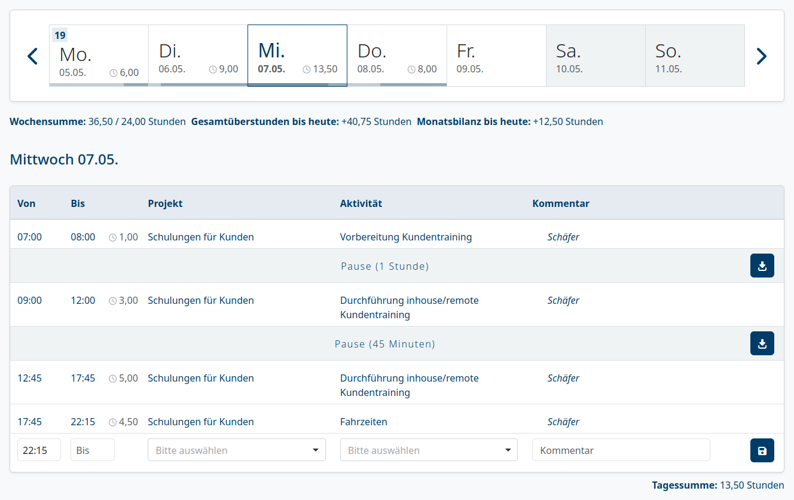

## SPrIng und Thymeleaf Zeit-Erfassung

- Den Rest des Tages wollen wir ein Zeiterfassungssystem programmieren
- Dazu lassen wir uns von folgendem Konkurrenz-Screenshot inspirieren:

- ⚠️ `Projekt` und `Aktivität` ignorieren wir erstmal
- Es empfiehlt sich das Abarbeiten untenstehender Meilensteine

### Ein einziger Zeiteintrag

- Das System kennt noch keine Tage, Wochen, Monate, Jahre...
- Am Anfang zeigt das System folgende Informationen an:
  - `Von`: 9:00
  - `Bis`: 17:00
  - `Kommentar`: Schulung
- Diese 3 Informationen können editiert werden
- `Von` darf nicht hinter `Bis` liegen

### Heute

- Das System zeigt das heutige Datum an
- Man kann Zeiteinträge...
  - hinzufügen
  - entfernen
  - editieren
- Zeiteinträge dürfen sich nicht überschneiden
- Zeiteinträge werden chronologisch aufgelistet
- Unten rechts wird eine berechete `Tagessumme` angezeigt

### Pausen

- Ist das `Bis` eines Zeiteintrags kleiner als das nächste `Von`?
  - Dann zeige eine entsprechende Pause an

### Aktuelle Woche

- Zeige oben die 7 Wochentage (Montag bis Sonntag) an
- Die Wochentage sind anklickbar
- An jedem Wochentag kann man eigene Zeiteinträge vornehmen
- Zeige oben links die `Wochensumme` an

### Wochen-Navigation

- Baue Navigationspfeile ein, um die Woche zu wechseln

### Feiertage

- An Feiertagen dürfen keine Zeiten eingetragen werden

### usw.

- Fehlen noch Features aus dem Screenshot?
- Vermisst du andere Features?
